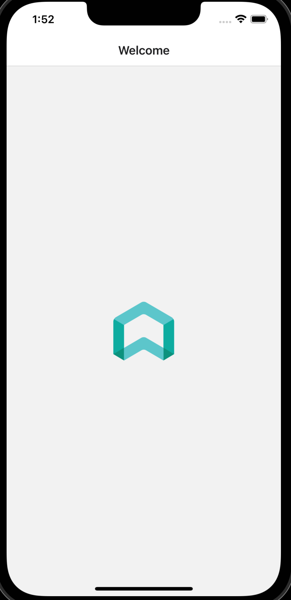

# SmartRent React Native Engineering Challenge

## Welcome

First of all, welcome to our React Native engineering challenge!

If you've made it this far, we are already interested in you. This challenge is not meant to trip you up, it's
designed for us to better learn where your technical skills lie and understand how you solve problems that might
come up in a day-to-day real world application.

### Setup

You will need these tools installed for the project to build:

**[nodejs](https://nodejs.org/en/download/) version 16.x**

**[yarn](https://yarnpkg.com/getting-started/install)**

**xcode or Android Studio (feel free to use either)**

1. Clone this repository

2. Run `yarn` to install dependencies

3. Start the app with `yarn ios` or `yarn android`.

Please build the app on a simulator or emulator, or prepare some way to screen share your physical device during the interview.

If everything works, you should see this welcome screen:

### Troubleshooting

This project is bootstrapped with [Expo](https://docs.expo.dev/), so check out their "getting started" guide if you run into any unexpected behavior.

### Typescript

If you would like to [convert the app to TypeScript](https://docs.expo.dev/guides/typescript), feel free to do so.

## Guidelines

- Feel free to install any dependencies you wish
- Refer to Google and documentation as needed

## Project Description

[Admiral Ackbar](https://en.wikipedia.org/wiki/Admiral_Ackbar) needs a mobile app to help him keep track of all the planets in the Star Wars universe. An engineering team has put together a public API with the data, but we need you to organize and display the planets on the app.

You can find the API documentation here: [https://swapi.dev/documentation#planets](https://swapi.dev/documentation#planets)

### Acceptance Criteria

1. Fetch the first page of planets and list the name of each planet on the home screen of your app. A user should be able to scroll through the list and read each name.
2. If a user taps on a planet, they should navigate to a new screen. The screen’s `title` should be the planet's name and the screen should list some details about the planet:
    1. gravity
    2. climate
    3. population
3. The screen should have a back button that takes the user back to the list view.

### Stretch Goals

1. On the home screen, a planet’s name should be green if the planet has `surface_water` and red if it does not.
2. A user should be able to favorite planets and their preferences should persist even if the app is closed.
3. On the home screen, once a user scrolls through the first page of planets it should fetch the next page and allow the user to keep scrolling through all pages of planets.